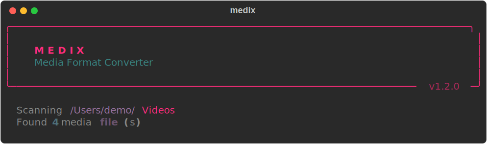
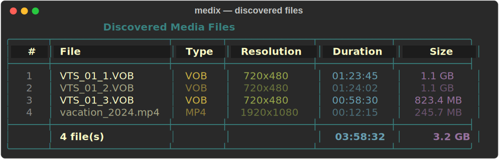
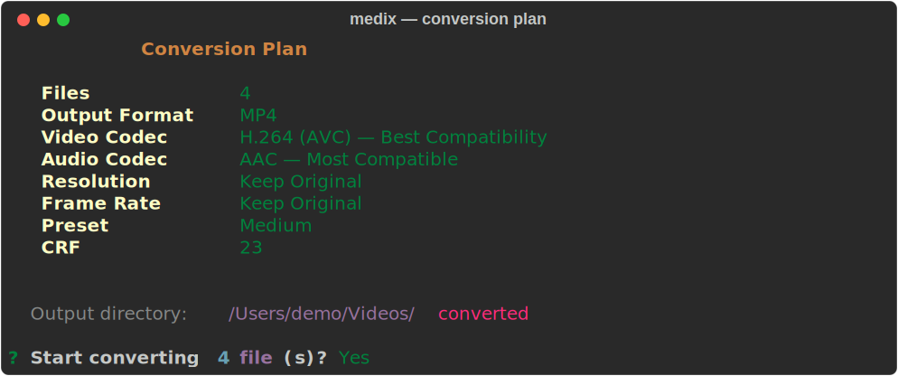
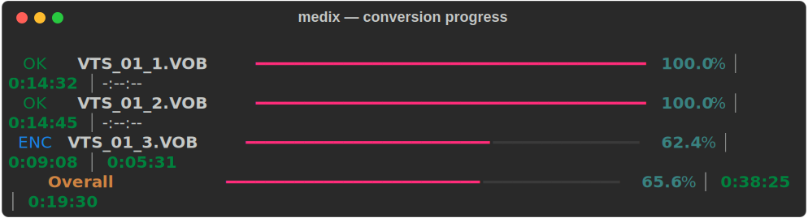
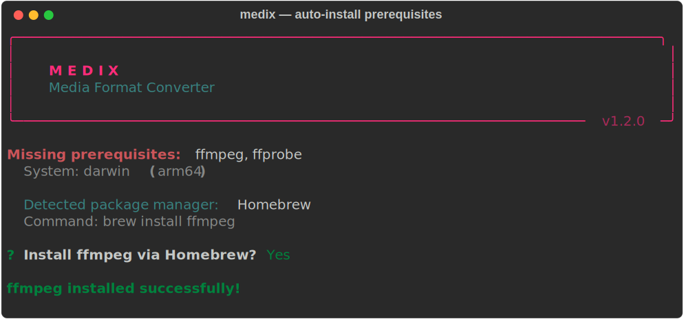
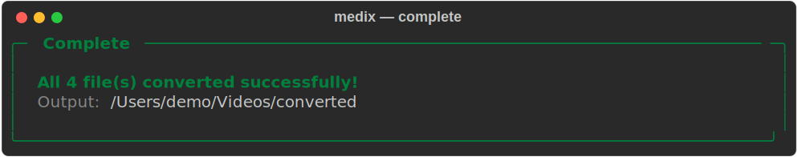

# Medix

[](https://github.com/vineethkrishnan/medix/actions/workflows/ci.yml)
[](https://pypi.org/project/medix/)
[](https://pypi.org/project/medix/)
[](LICENSE)

A fancy command-line media format converter powered by FFmpeg. Interactively choose source and target formats, tweak advanced encoding settings, and watch conversions fly with real-time progress bars.

<p align="center">
  
</p>

---

## Demo

### File Discovery

Medix scans your path and presents a clean table of all discovered media files with resolution, duration, and size.

<p align="center">
  
</p>

### Conversion Plan & Progress

Review your settings before starting, then watch per-file and overall progress in real time.

<p align="center">
  
</p>

<p align="center">
  
</p>

### Auto-Install Prerequisites

No FFmpeg? No problem. Medix detects your OS, finds a package manager, and offers to install it for you.

<p align="center">
  
</p>

### Completion Summary

<p align="center">
  
</p>

---

## Requirements

| Dependency | Minimum Version | Check Command |
|-----------|----------------|---------------|
| **Python** | 3.9+ | `python3 --version` |
| **FFmpeg** | 4.4+ | `ffmpeg -version` |
| **ffprobe** | (bundled with FFmpeg) | `ffprobe -version` |

> **Note:** If FFmpeg is not installed, Medix will detect your system and offer to install it automatically via your package manager (Homebrew, APT, DNF, Pacman, winget, Chocolatey, and more).

### Supported Platforms

- macOS 12+ (Homebrew, MacPorts)
- Ubuntu 20.04+ / Debian 11+ (APT)
- Fedora / RHEL (DNF, YUM)
- Arch Linux (Pacman)
- Windows 10+ (winget, Chocolatey, Scoop)

---

## Installation

### From PyPI (recommended)

```bash
pip install medix
```

### From Source

```bash
git clone https://github.com/vineethkrishnan/medix.git
cd medix
python3 -m venv .venv
source .venv/bin/activate   # Windows: .venv\Scripts\activate
pip install -e .
```

Verify:

```bash
medix --version
```

---

## Usage

```bash
# Convert a single file
medix /path/to/video.vob

# Convert all media files in a directory
medix /path/to/videos/

# Recurse into subdirectories
medix /path/to/videos/ -r

# Specify output directory
medix /path/to/videos/ -o /path/to/output/
```

### What Happens

1. Medix checks for FFmpeg — if missing, it offers to install it automatically.
2. Scans the path and lists discovered media files with metadata (resolution, duration, size).
3. If multiple source formats exist, you pick which ones to convert.
4. Choose an output format (MP4, MKV, WebM, MOV, AVI, TS).
5. Optionally configure advanced settings — codec, resolution, frame rate, CRF, preset, bitrate.
6. Review the conversion plan and confirm.
7. Watch per-file and overall progress bars in real time.

### CLI Reference

```
Usage: medix [OPTIONS] PATH

  Medix - Convert media files between formats with style.

Options:
  -o, --output PATH  Output directory (default: <input>/converted/)
  -r, --recursive    Recurse into subdirectories
  --version          Show version and exit
  -h, --help         Show help and exit
```

---

## Supported Formats

### Input (20+)

VOB, MP4, MKV, AVI, MOV, WMV, FLV, MPEG, MPG, TS, WebM, M4V, 3GP, OGV, MTS, M2TS, DIVX, ASF, RM, RMVB, F4V

### Output

| Format | Default Codecs | Best For |
|--------|---------------|----------|
| **MP4** | H.264 + AAC | Universal playback |
| **MKV** | H.264 + AAC | Flexible container |
| **WebM** | VP9 + Opus | Web streaming |
| **MOV** | H.264 + AAC | Apple ecosystem |
| **AVI** | H.264 + MP3 | Legacy compatibility |
| **TS** | H.264 + AAC | Broadcast / streaming |

### Advanced Settings

When enabled, you can configure:

- **Video codec** — H.264, H.265, VP9, AV1, MPEG-4, or copy (no re-encode)
- **Audio codec** — AAC, MP3, Opus, AC3, FLAC, or copy
- **Resolution** — Keep original, 4K, 2K, 1080p, 720p, 480p, 360p
- **Frame rate** — Keep original, 24, 25, 30, 48, 60 fps
- **Encoding preset** — ultrafast to veryslow (H.264/H.265)
- **CRF quality** — 0–51 (lower = better quality, larger file)
- **Audio bitrate** — Auto, 96k–320k

---

## Development

```bash
git clone https://github.com/vineethkrishnan/medix.git
cd medix
python3 -m venv .venv
source .venv/bin/activate
pip install -e .
```

### Re-generate demo screenshots

```bash
python assets/generate_demos.py
```

This project uses [Conventional Commits](https://www.conventionalcommits.org/) and [Release Please](https://github.com/googleapis/release-please) for automated versioning and changelog generation.

See [CONTRIBUTING.md](CONTRIBUTING.md) for guidelines.

---

## License

[MIT](LICENSE) — see [LICENSE](LICENSE) for details.
