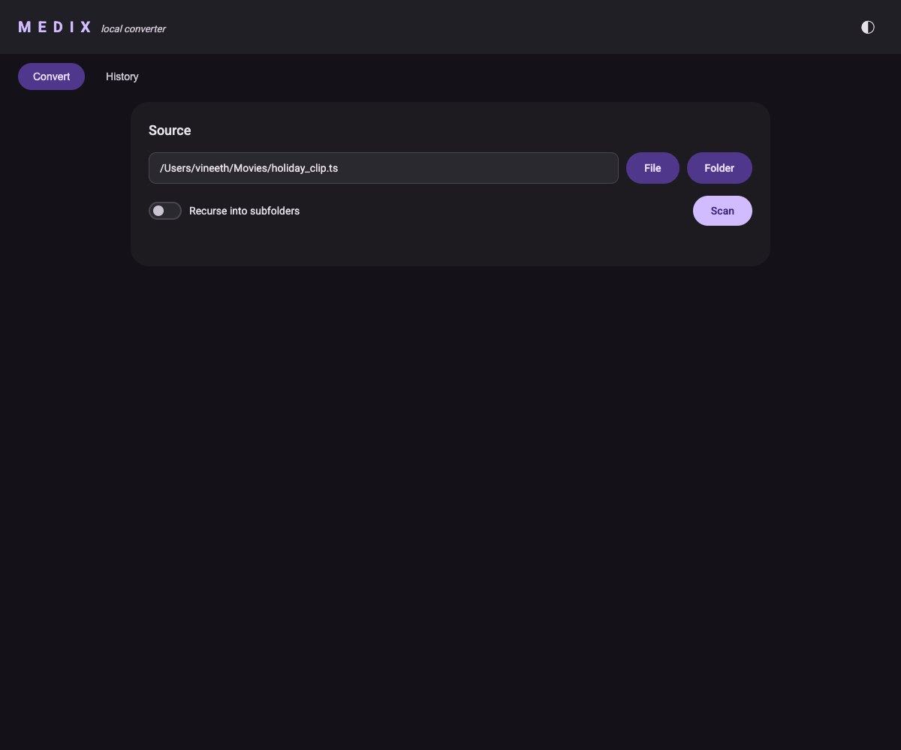
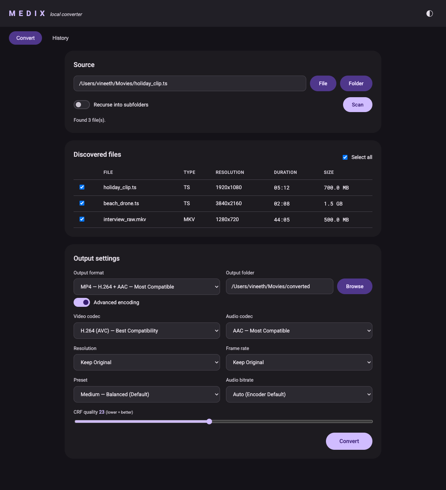
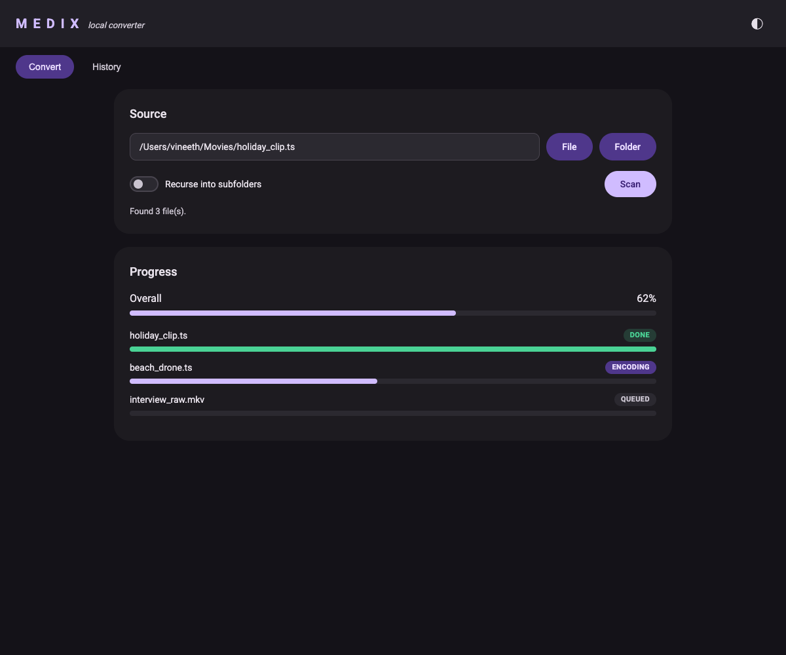
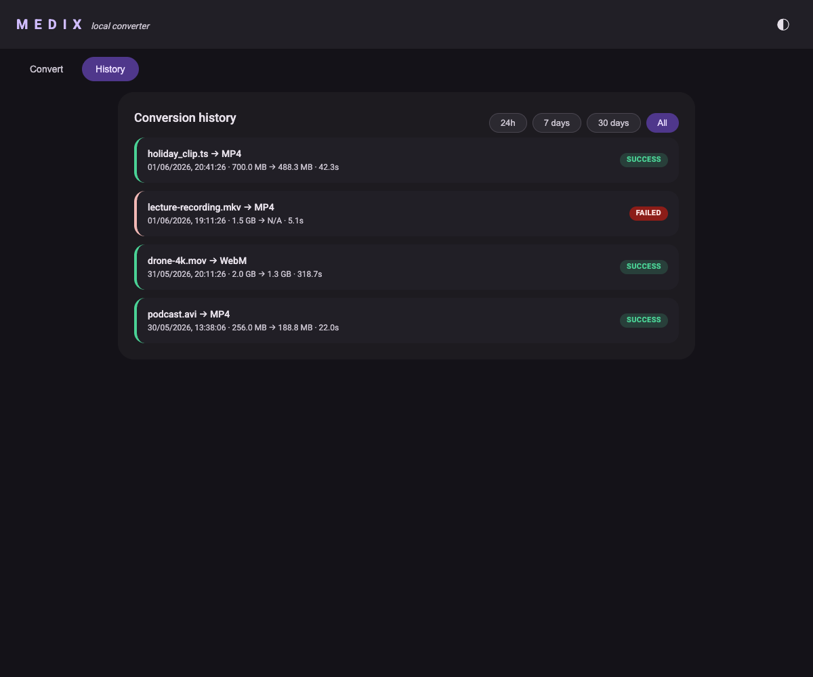

Medix ships with an optional local web GUI: a Material Design interface that
runs entirely on your machine and drives the same FFmpeg engine as the CLI.
Files never leave your computer, there is no login, and nothing is uploaded
anywhere.



## Starting the GUI

The GUI does **not** start automatically on install. It is a separate command,
`medix-gui`, that you run when you want it:

```bash
medix-gui
```

This starts a local server on `http://127.0.0.1:8756/` and opens your default
browser. Press `Ctrl+C` in the terminal to stop it.

### Options

| Flag | Default | Description |
|------|---------|-------------|
| `--port` | `8756` | Port to bind. |
| `--host` | `127.0.0.1` | Host to bind. Keep it on localhost unless you know what you're doing. |
| `--no-browser` | off | Start the server without opening a browser. |
| `--version` | | Print version and exit. |
| `--help` / `-h` | | Show help and exit. |

Run it on a specific port:

```bash
medix-gui --port 9000
```

Start it headless (no browser pop-up), then open the URL yourself:

```bash
medix-gui --port 9000 --no-browser
```

:::note
The GUI is bound to `127.0.0.1` by default, so it is only reachable from your
own machine. It is meant as a single-user local tool, not a hosted service.
:::

## Running it as a background daemon

Instead of keeping a terminal open, you can run the GUI detached and manage it
with subcommands:

```bash
medix-gui start      # run in the background, prints the pid and port
medix-gui status     # show whether it's running, with pid and port
medix-gui stop       # stop the background process
```

`start` reads `--host` / `--port` from the group options, so to bind a specific
port: `medix-gui --port 9000 start`. The background server writes its logs to
`gui.log` and its process info to `gui-daemon.json`, both under your config
directory.

## Auto-start at login (macOS)

To keep the GUI permanently available, install a launchd service. It starts at
login, restarts if it crashes, and survives reboots:

```bash
medix-gui install-service      # writes ~/Library/LaunchAgents/de.vinelabs.medix-gui.plist and loads it
medix-gui uninstall-service    # unloads and removes it
```

Use `--port` to pick the port the service binds: `medix-gui --port 9000 install-service`.

:::note
`install-service` / `uninstall-service` are macOS-only (launchd). On Linux, use
`medix-gui start` from a `systemd --user` unit; on Windows, from a Startup
shortcut or Task Scheduler entry.
:::

## Pointing at your media

Type or paste a path into the **Source** field, or use the pickers:

- **File** — choose a single media file.
- **Folder** — choose a directory. Toggle **Recurse into subfolders** to scan
  the whole tree.

Click **Scan** to discover media files. Medix probes each file with `ffprobe`
and lists them with type, resolution, duration, and size.



Uncheck any files you don't want, pick the **Output format**, and set the
**Output folder** (it defaults to `<input>/converted/`, and has its own
**Browse** button). Flip on **Advanced encoding** to tune video/audio codec,
resolution, frame rate, preset, CRF, and audio bitrate, exactly like the CLI's
advanced prompts.

## Watching progress

Click **Convert** and the progress card shows a live overall bar plus a bar per
file, streamed from the server as each file encodes. Status chips move from
`QUEUED` to `ENCODING` to `DONE` (or `FAILED`, with the error available).



When everything finishes, a summary appears with the success/failure counts and
an **Open output folder** button.

## Conversion history

Every conversion is recorded locally. The **History** tab lists past runs and
lets you filter by time window: **24h**, **7 days**, **30 days**, or **All**.



Each entry shows the input file, target format, input/output sizes, how long it
took, and whether it succeeded. History is stored as a plain JSON file under
your config directory:

| Platform | Location |
|----------|----------|
| macOS / Linux | `~/.config/medix/history.json` (or `$XDG_CONFIG_HOME/medix/`) |
| Windows | `%APPDATA%\medix\history.json` |

You can override the location with the `MEDIX_CONFIG_DIR` environment variable.
Delete the file to clear your history.

## CLI vs GUI

The GUI and CLI share the same engine and produce identical output. Use whichever
fits the moment:

- **CLI (`medix`)** — fast, scriptable, great over SSH. See [CLI Usage](/guides/cli-usage/).
- **GUI (`medix-gui`)** — point-and-click, live progress, and browsable history.
